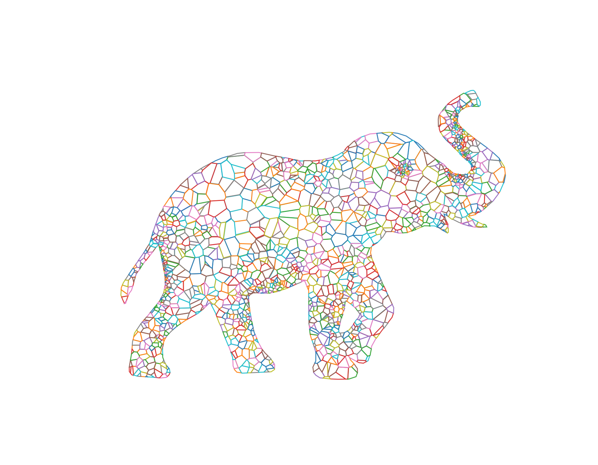

# Voronify

Contains a utility module `voronify.py` and associated ipynb.
Points are generated across a space and converted into a Voronoi-net.
Then, a shape defined by a set of svg paths is used to cookie-cut out
a section of the voronoi area.
The voronoi cells are then mapped onto a lattice and translated to their
starting locations.
The final animation starts from the "exploded" lattice and iteratively
moves each cell back to its correct location.

> [!NOTE]
> The code is scrappy and was thrown together to quickly generate some
powerpoint animations - don't judge!
